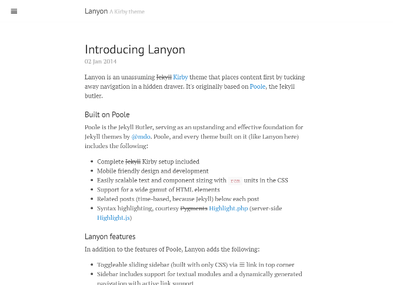

# Kirby Lanyon
  

A Kirby port of the [Jekyll](https://jekyllrb.com) theme '[Lanyon](https://github.com/poole/lanyon)'.

**Table of contents**
- [1. Getting started](#getting-started)
- [2. Credits / License](#credits--license)

## Getting started
Use one of the following methods to start blogging with `kirby-lanyon`:

1. [Clone](https://github.com/S1SYPHOS/kirby-lanyon.git) or [download](https://github.com/S1SYPHOS/kirby-lanyon/archive/master.zip) this repository.
2. Unzip / Upload the folder to your site's `root`.

For more information about available features (sidebar overlay / push + open / closed on page load, reverse layout & available themes), check out the [original project](https://github.com/poole/lanyon) or view [its demo](http://lanyon.getpoole.com/) - `kirby-lanyon` basically looks the same.

## Credits / License
This is a [port](https://en.wikipedia.org/wiki/Porting) of the Jekyll theme 'Lanyon', which was originally developed by [@mdo](https://github.com/mdo). `kirby-lanyon` is licensed under the [MIT License](LICENSE), but **using Kirby in production** requires you to [buy a license](https://getkirby.com/buy). Are you ready for the [next step](https://getkirby.com/next)?

## Special Thanks
I'd like to thank everybody that's making great software - you people are awesome. Also I'm always thankful for feedback and bug reports :)
